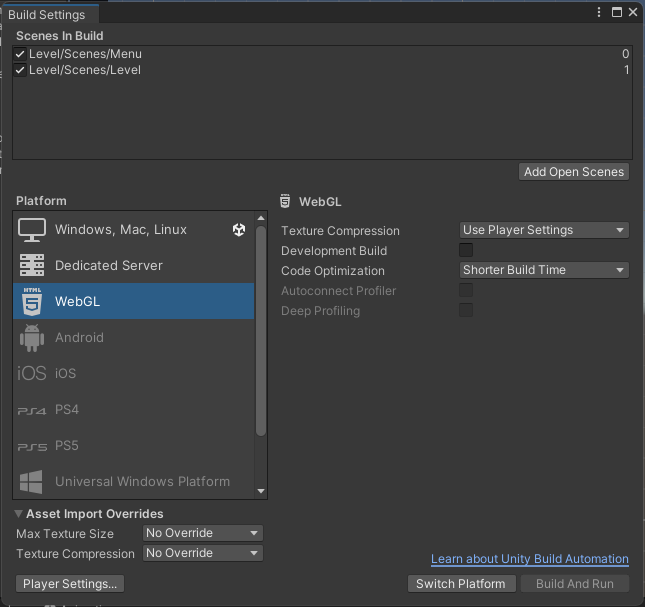
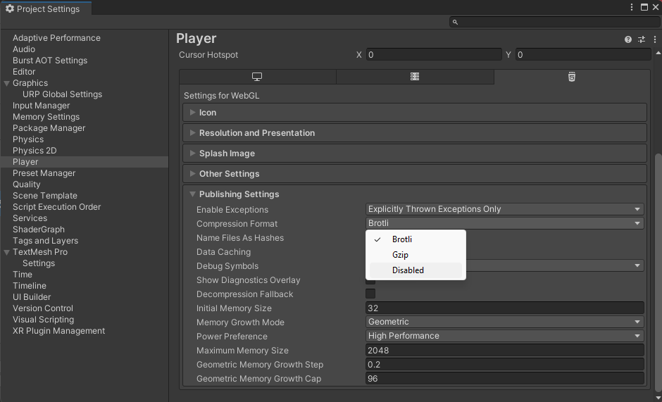

# Build

Pour effectuer un build, il faut se rendre dans le menu ```File/Build and Run```

Dans la zone ```Scenes in Build```, il faut glisser les scènes que l'on souhaite utilisé pour le jeu.

On sélectionne ensuite la platform. Pour une game jam, il est souveant plus simple de faire un buid WebGL. Après avoir sélectionner dans ```Platform``` webGL, il faut cliquer sur le bouton ```Switch Platform```. Cela va préparer le projet pour cette environnement de destination.



Certain navigateur ne supporte pas la compression du projet en Broli. Il faut cliquer sur ```Player Settings``` pour ouvrir les propriétés du projet.

Dans la fenètre ```Project Settings```, il faut se rendre dans le collapse ```Publishing Settings```.

Là, il y a champ de selection qui permet de modifier le type de compression. On peut cliquer sur ```Disable``` pour qu'il n'y aie plus de compression.

