# Input system dans Unity

Unity possède une gestion des entrées de base.

Celle-ci est utilisable avec la classe [```Input```](https://docs.unity3d.com/ScriptReference/Input.html). 

Dans le menu ```Edit/Project Settings```, sous la section Input Manager, il est possible de configurer les touches par défaut su système.

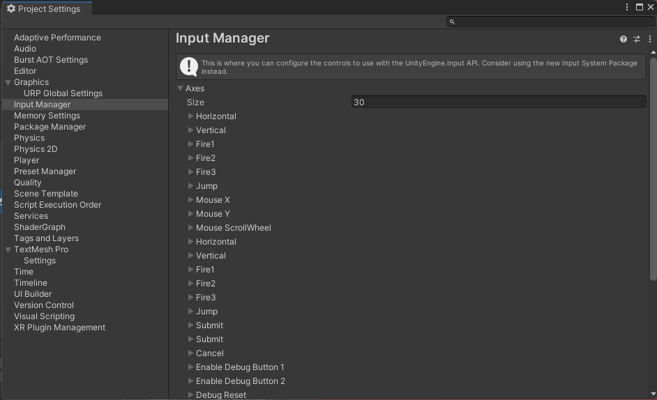

## Installation du nouveau Input system

Pour installer le nouveau système, il faut ouvrire le menu ```Window/Package Manager```. Dans celui-ci, sélectionner  ```Unity Registry``` dans le selecteur de type de package.

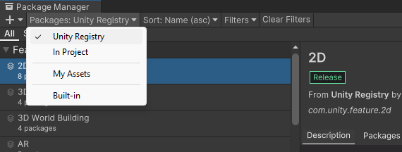

Recherchez ensuite Input System et cliquez sur le bouton Install

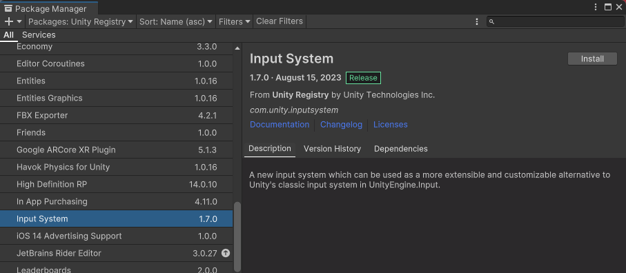

Une fois que l'installation est terminé, on vous demande si vous voulez activer le nouveau système ou garder le courant. Si on clique sur ```yes```, Unity se redémarre.

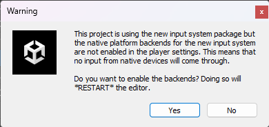

Sous les paramètres du projet, il est toujours possible de spécifer un type de gestionnaire d'input ou d'accepter les deux en parallèle.

Dans le menu ```Edit/Project Settings```, dans la section ```Player```, sous le collapse ```Other Settings```, le selecteur ```Active input handling``` permet de modifier cette valeur.

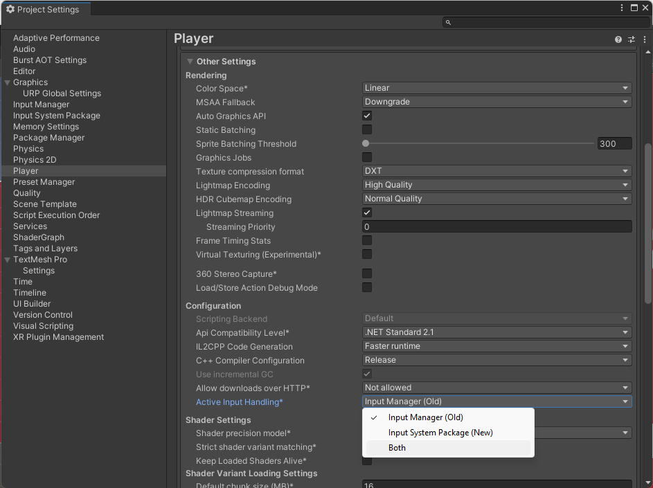


Dans la zone du projet, il faut ensuite créer un jeu d'action. Pour se faire, 

Cliquez avec le bouton droit sur ```Create/Input Actions```.

On peut nommer le fichier d'input actions comme on le souhaite.

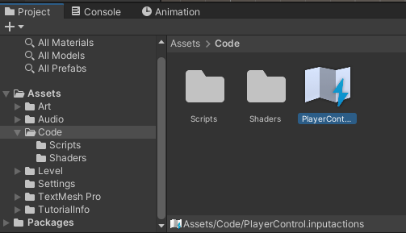

On peut double cliquer sur ce fichier pour éditer les actions :

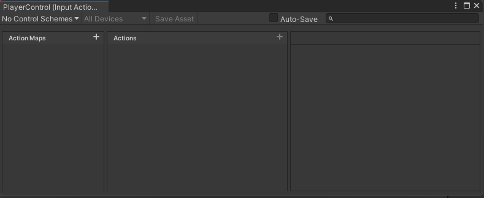

Ajouter un type de contrôleur

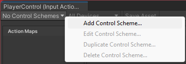

Sélectionner dans la liste le type de contrôleur.

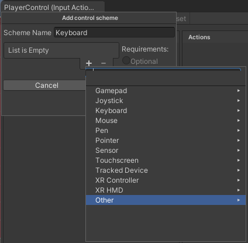

Ajouter une action map.

Ceci permet d'avoir des groupes d'actions différents en jeu. Par exemple, un groupe d'action pour se déplacer à pied et un groupe d'action pour conduire un véhicule.

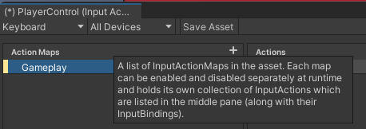

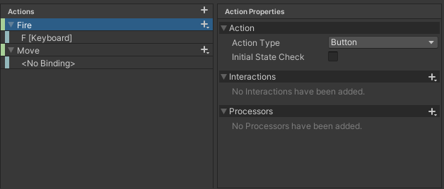

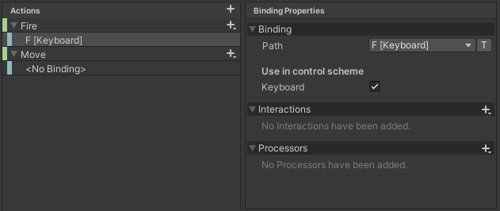

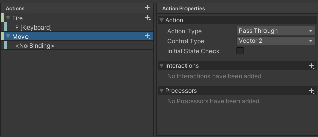

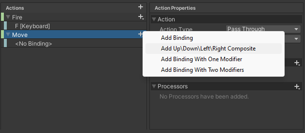

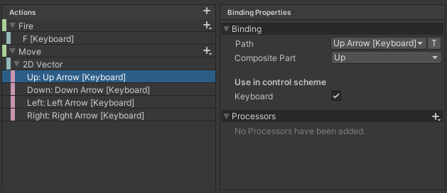

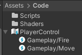

Ajouter sur le player le Component ```Payer Input```

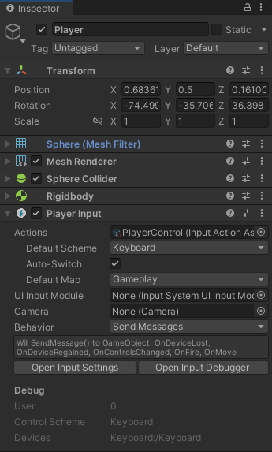

Exemple de script pour le déplacement d'un personnage

```c#

using System.Collections;
using System.Collections.Generic;
using UnityEngine;
using UnityEngine.InputSystem;

public class PlayerControl : MonoBehaviour
{
    public Rigidbody rb;

    public float moveSpeed = 1f;

    public InputActionReference move;

    private Vector3 moveDirection = Vector3.zero;

    // Update is called once per frame
    void Update()
    {
        Vector2 direction = move.action.ReadValue<Vector2>();

        moveDirection = new Vector3(direction.x, 0, direction.y);

    }

    private void FixedUpdate()
    {
        rb.velocity = moveDirection * moveSpeed;
    }
}

```

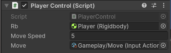