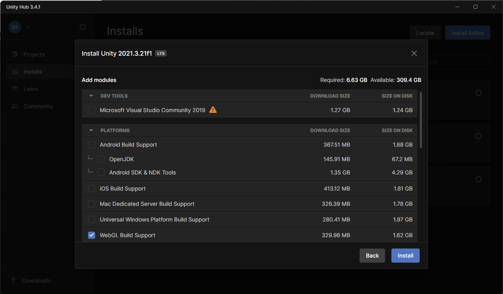

# Installation

Petite procédure de démarrage pour l'installation du projet.

# Installation UnityHub

Pour faire fonctionner le projet, il faut installer Unity. 

Il faut se rendre sur le site [Unity](https://unity.com/fr/download) pour télécharger UnityHub. Ce logiciel vous permettera d'installer l'une des versions d'Unity.

Il faudra également faire un compte chez Unity pour pouvoir utiliser le logiciel.

# Installation de l'éditeur

Une fois que vous avez un compte Unity et UnityHub, il faut installer une version de l'éditeur Unity.

Pour se faire, il faut allez dans le menu latéral gauche __Install__ et cliquer sur __install editor__

En suite, il faut choisir un version LTS. J'ai pris la dernière qui est la __2021.3.21f__

Il faudra un éditeur C#. C'est possible de sélectionner Microsoft Visual Studio Community 2019 mais je conseil d'installer la [dernière version de Microsoft](https://visualstudio.microsoft.com/fr/vs/community/).

On peut ajouter le builder WebGl qui permettera de faire des jeux compilés pour le navigateur.

# Installation du projet

I faut se rendre sur le dépôt [upsijam3](https://github.com/danielthalmann/upsijam3) et effectuer un clône dans un répertoire local.

Ensuite, dans UnityHub, il faut ajouter un projet déjà existant. Il suffit ensuite de démarrer le projet.

