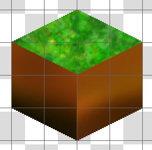
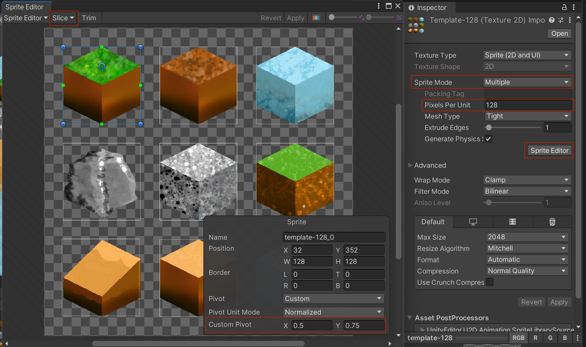
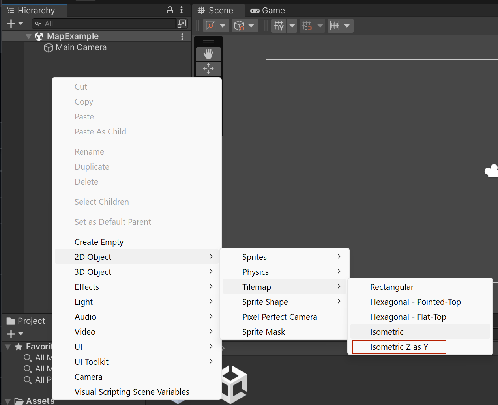
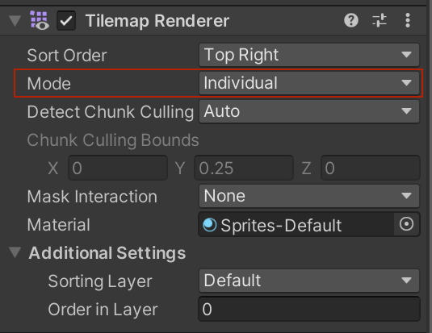
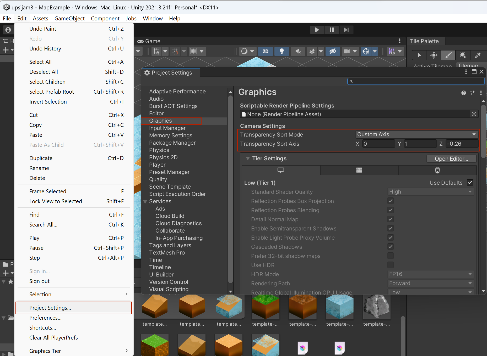
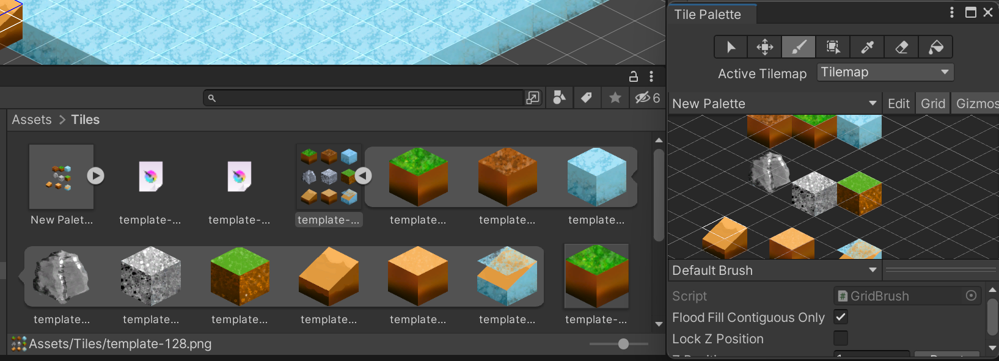
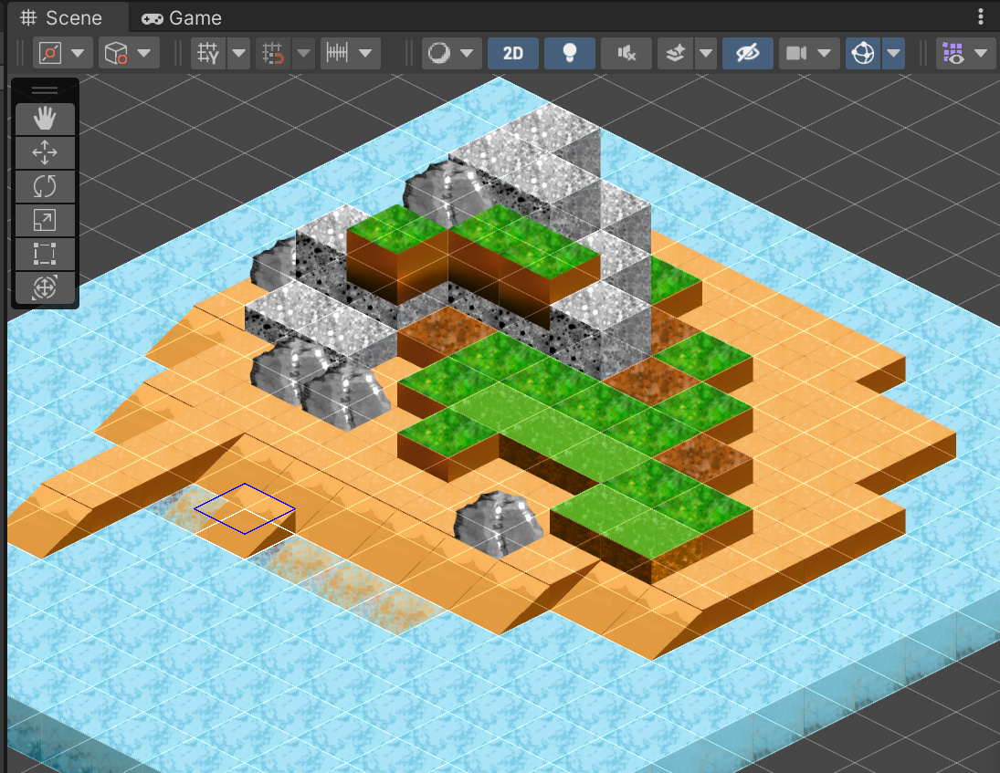

# creation de map isométrique

## images

on commence par créer les différentes tuiles de la carte.

Idéalement, la taille des tuiles doit être complétement carré. Dans l'exemple suivant, j'ai créé un cube de 128px par 128px. 

Dans la même image, j'ai disposé plusieurs de ces cubes.

[Image exemple utilisé dans l'explication](images/07-example.png)

## importation dans Unity

On ajout dans Unity l'image contenant les différents cubes.

Dans les propriétés __Inspector__, il faut sélectionner __Sprite mode__ sur __Multiple__.

Il faut également modifier le nombre de pixel par unité de votre image.

Dans mon exemple, mon cube fait une largeur de 128px. Il faut donc que je saisie dans __Pixels Per Unit__ : 128.

Si j'avais fait des cubes de 64 par 64px, j'aurais dû mettre la valeur de __Pixels Per Unit__ à 64.

L'étape suivante est de rendre individuel tous les cubes. Pour cela, on clique sur __Sprite Editor__.

Cela ouvre une interface d'édition du sprite.

Pour se simplifier la vie, on peut utiliser l'option __Slice__ qui permettera de découper automatiquement les contour des images.

Pour que la position de l'image fonctionne correctement dans l'éditeur de map, il faut déplacer le centre du pivot de l'image.

Pour se faire, dans le paramètre __Custom Pixel__, saisissez la valeur __x__: 0.5, __y__: 0.75.

## ajout d'une map

Dans la __Hierarchy__, ajoutez une map __isometric Z as Y__ comme illustré sur l'image suivante :

Pour que les images se supperpose correctement sur la map, il faut appliquer le __mode__ __individual__ dans le composant __TIlemap Renderer__.

Il faut également modifier le paramètre de l'ordre d'affichage des images dans les propriétés du projet comme suite :

## ajouter les images dans la palette

On glisse ensuite les images présentes dans le détail des tiles vers la __Tile Palette__.

Si la palette n'est pas visible dans l'interface, il est possible de l'afficher avec le point de menu __Window__ / __2D__ / __Tile Palette__

Le paramètre __Z position__ qui se trouve dans __Tile Palette__ permet de modifier la hauteur des tuiles. 

## Final

Pour finir, on peut composer à l'aide de la palette de tuile la map final !

